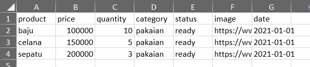
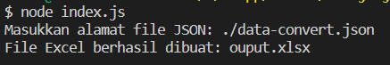

# nodejs-json-to-excell
 Mengubah JSON ke Excell dengan nodejs

# Cara Menggunakan
1. Jalankan dengan perintah
    ```node
    node index.js
    ```
2. Daftarkan file `.json` yang akan diubah ke `.xlsx` \
    Disini saya sudah menyediakan contoh file `.json` yang harus diconvert.
    ```
    Masukkan alamat file JSON: ./data-convert.json
    ```
3. Hasilnya difile berikut \
   ```
   File Excel berhasil dibuat: ouput.xlsx
   ```
5. Selesai
# Dokumentasi
- isi dari file `data-convert.json`
```json
{
  "data": [
    {
      "product": "baju",
      "price": 100000,
      "quantity": 10,
      "category": "pakaian",
      "status": "ready",
      "image": "ht...aw",
      "date": "2021-01-01"
    },
    {
      "product": "celana",
      "price": 150000,
      "quantity": 5,
      "category": "pakaian",
      "status": "ready",
      "image": "https://....",
      "date": "2021-01-01"
    },
    {
      "product": "sepatu",
      "price": 200000,
      "quantity": 3,
      "category": "pakaian",
      "status": "ready",
      "image": "https://www.google.com/....",
      "date": "2021-01-01"
    }
  ]
}

```
- hasil `output.xlsx`
  

- cara menjalankan program


